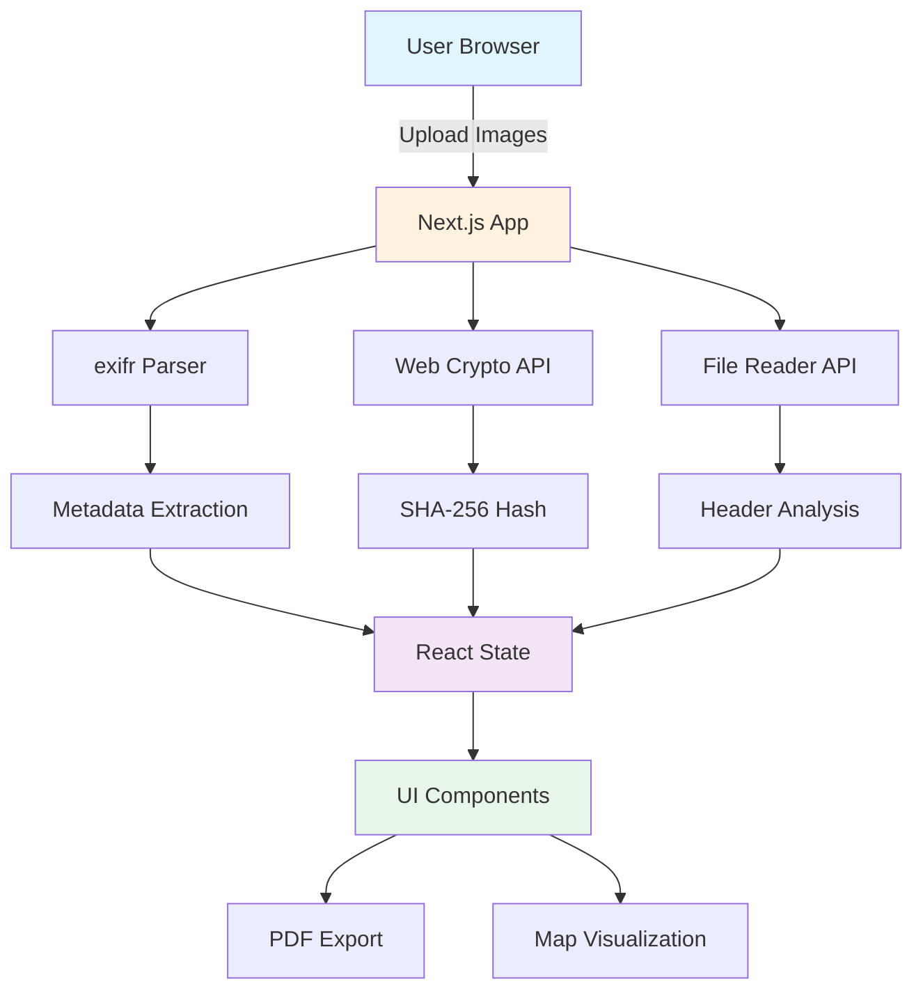

# 📸 Client-Side EXIF / Hash Inspector

<div align="center">


<h3>A comprehensive browser-based tool for analyzing image metadata, computing file hashes, and generating detailed reports — all processed locally in your browser</h3>

**[Features](#✨-features) • [Installation](#🚀-installation) • [Usage](#💻-usage) • [Project Structure](#📁-project-structure) • [Privacy & Security](#🔒-privacy--security)**

</div>

---

## 📖 Overview

The **Client-Side EXIF / Hash Inspector** is a modern web application built with Next.js that enables comprehensive analysis of image metadata without requiring any backend infrastructure. All processing occurs entirely in the browser, ensuring complete privacy and zero server costs.

### 🎯 Key Objectives
- **🔍 Complete metadata extraction** - Parse EXIF, IPTC, XMP, and GPS data
- **🔐 File integrity verification** - Compute SHA-256 hashes for uploaded images
- **📊 Side-by-side comparison** - Compare metadata between two images
- **🗺️ Location visualization** - View GPS coordinates on interactive maps with reverse geocoding
- **📄 Professional reports** - Export detailed PDF reports with all metadata
- **🔒 Privacy-first** - Zero data transmission; all processing happens client-side

### 🌟 Why Client-Only?
- **Zero backend costs** - Perfect for Vercel free tier deployment
- **Complete privacy** - Files never leave your browser
- **No server maintenance** - Simple static deployment
- **Fast processing** - Direct browser-based analysis using `exifr`

## ✨ Features

### 📤 Image Upload & Management
- ➕ **Drag & drop upload** - Intuitive file upload interface
- 🖼️ **Multiple format support** - JPG, PNG, HEIC, and more
- 📋 **Image gallery** - Visual grid of uploaded images with thumbnails
- 🔍 **Quick preview** - Instant image preview with file details

### 📊 Metadata Analysis
- **📸 EXIF Data Extraction**
  - Camera settings (ISO, aperture, shutter speed, focal length)
  - Device information (make, model, software)
  - Timestamps (creation date, modification date)
  - Image dimensions and orientation

- **🌍 GPS & Location**
  - GPS coordinate extraction
  - Reverse geocoding (coordinates → address)
  - Interactive map visualization with Leaflet
  - Location history tracking

- **🏷️ IPTC & XMP**
  - IPTC metadata parsing
  - XMP data extraction
  - Complete metadata dictionary view

### 🔐 File Integrity
- **🔒 SHA-256 Hashing**
  - Cryptographic hash computation
  - File integrity verification
  - Hash comparison between files

- **📝 Header Analysis**
  - JPEG header inspection (SOI markers)
  - Binary header byte visualization
  - File format validation

### 🔄 Comparison Tools
- **⚖️ Side-by-Side Comparison**
  - Select any two images for comparison
  - Visual diff matrix showing differences
  - Highlighted metadata discrepancies
  - Missing/added field indicators

### 📄 Report Generation
- **📑 Comprehensive Reports**
  - Detailed metadata tables
  - GPS location information
  - File hash documentation
  - Professional PDF export
  - Print-ready formatting

## 🏗️ System Architecture



## 📁 Project Structure

```
metadata/
│
├── 📂 src/
│   ├── 📂 app/                    # Next.js app directory
│   │   ├── layout.tsx            # Root layout with fonts
│   │   ├── page.tsx              # Main application page
│   │   ├── globals.css           # Global styles
│   │   └── 📂 report/            # Report components
│   │       ├── Preview.tsx       # HTML report preview
│   │       └── PDFPreview.tsx   # PDF-optimized report
│   │
│   ├── 📂 components/             # React components
│   │   ├── Uploader.tsx         # File upload component
│   │   ├── MetaTable.tsx         # Metadata display table
│   │   ├── CompareMatrix.tsx    # Comparison diff matrix
│   │   ├── CompareTable.tsx     # Comparison table view
│   │   ├── HeaderPeek.tsx        # JPEG header inspector
│   │   ├── MapModal.tsx         # GPS map modal
│   │   ├── Toolbar.tsx          # Export toolbar
│   │   └── 📂 ui/               # shadcn/ui components
│   │       ├── button.tsx
│   │       ├── card.tsx
│   │       ├── dialog.tsx
│   │       └── ...
│   │
│   └── 📂 lib/                   # Utility libraries
│       ├── exif.ts              # EXIF parsing wrapper
│       ├── hash.ts              # SHA-256 computation
│       ├── header.ts            # JPEG header reader
│       ├── diff.ts              # Metadata comparison
│       ├── geocode.ts           # Reverse geocoding
│       ├── pdf.ts               # PDF export utility
│       ├── preview.ts           # Image preview generation
│       └── utils.ts             # Helper functions
│
├── 📂 public/                    # Static assets
│   └── *.svg                    # Icon files
│
├── 📄 Configuration Files
│   ├── package.json             # Dependencies & scripts
│   ├── tsconfig.json            # TypeScript config
│   ├── next.config.ts           # Next.js config
│   ├── tailwind.config.js       # Tailwind CSS config
│   ├── components.json          # shadcn/ui config
│   └── eslint.config.mjs        # ESLint config
│
├── 📄 Documentation
│   ├── README.md                # This file
│   └── QUICKSTART.md            # Quick start guide
│
└── 📄 Scripts
    ├── run.sh                   # Run script
    └── setup-node.sh            # Node version setup
```

## 🚀 Installation

### Prerequisites

- **Node.js** >= 20.9.0
- **npm** >= 10.0.0
- **Git** for version control (optional)

### Step-by-Step Installation

1. **Clone the Repository**
   ```bash
   git clone <repository-url>
   cd metadata
   ```

2. **Install Dependencies**
   ```bash
   npm install
   ```

3. **Verify Node Version** (if needed)
   ```bash
   node -v  # Should show v20.x.x or higher
   ```
   
   If you need to switch Node versions, see [QUICKSTART.md](QUICKSTART.md) for nvm setup instructions.

4. **Start Development Server**
   ```bash
   npm run dev
   ```

5. **Access the Application**
   
   Open your browser and navigate to: **http://localhost:3000**

## 💻 Usage

### Basic Workflow

1. **Upload Images**
   - Drag and drop images onto the upload area, or
   - Click to browse and select image files
   - Supported formats: JPG, PNG, HEIC, and other common image formats

2. **View Metadata**
   - Click on any uploaded image thumbnail
   - View complete metadata table with all EXIF, IPTC, and XMP data
   - Check file hash (SHA-256) for integrity verification
   - Inspect JPEG header information

3. **Compare Images**
   - Select two images from the dropdown menus
   - View side-by-side comparison matrix
   - Identify differences and missing fields

4. **Explore Location Data**
   - If GPS coordinates are present, view them on an interactive map
   - See reverse-geocoded address information
   - Click "View on Map" to open full-screen map modal

5. **Export Reports**
   - Click "Export report (PDF)" button in the toolbar
   - Download a comprehensive PDF report with all metadata
   - Report includes file hashes, GPS data, and complete metadata tables

### Advanced Features

- **HEIC Support**: Automatically converts HEIC files for browser compatibility
- **Batch Processing**: Upload multiple images and switch between them seamlessly
- **Lazy Loading**: Metadata is parsed on-demand to optimize memory usage
- **Responsive Design**: Works on desktop, tablet, and mobile devices

## 🛠️ Tools & Technologies

### Core Technologies
-  **Next.js 16** - React framework with App Router
-  **React 19** - UI library
-  **TypeScript** - Type safety
-  **Tailwind CSS 4** - Utility-first styling

### Key Libraries
- **exifr** - EXIF/IPTC/XMP metadata parsing
- **heic2any** - HEIC image format conversion
- **html2pdf.js** - PDF generation from HTML
- **leaflet** / **react-leaflet** - Interactive maps
- **lucide-react** - Icon library
- **@radix-ui** - Accessible UI primitives

### Development Tools
-  **ESLint** - Code linting
-  **Git** - Version control

## 🔒 Privacy & Security

### Client-Side Processing
- ✅ **Zero data transmission** - Files never leave your browser
- ✅ **No server storage** - Nothing is uploaded or stored remotely
- ✅ **Local processing only** - All analysis happens in your browser
- ✅ **No tracking** - No analytics or user tracking

### Security Features
- ✅ **Web Crypto API** - Native browser cryptographic hashing
- ✅ **Secure file handling** - Files processed via FileReader API
- ✅ **No external dependencies** - Metadata parsing uses client-side libraries
- ✅ **Privacy by design** - Built from the ground up for privacy

### Important Disclaimers

⚠️ **EXIF Timestamp Accuracy**
- EXIF timestamps can be inaccurate due to device clock changes or failures
- Always corroborate with other artifacts (location, lighting, sun position, etc.)

⚠️ **Hash Integrity**
- Hashes are provided for integrity of files as uploaded to this tool (educational use)
- Edits via iOS Markup often do not update EXIF ModifyDate
- Hashes may differ while metadata times remain unchanged

⚠️ **Educational Purpose**
- This tool is designed for learning and analysis purposes
- Always verify critical metadata through multiple sources

## 🚢 Deployment

### Deploy to Vercel (Recommended)

1. **Push to GitHub**
   ```bash
   git add .
   git commit -m "Initial commit"
   git push origin main
   ```

2. **Import to Vercel**
   - Go to [vercel.com](https://vercel.com)
   - Click "New Project"
   - Import your GitHub repository
   - Framework: **Next.js** (auto-detected)
   - Click "Deploy"

3. **Automatic Deployment**
   - Vercel will automatically build and deploy
   - Your app will be live at `your-project.vercel.app`
   - Future pushes to main branch auto-deploy

### Build for Production

```bash
npm run build
npm start
```

### Environment Variables

No environment variables required! This application runs entirely client-side.

## 🐛 Troubleshooting

### Common Issues

1. **Node.js Version Error**
   ```
   Error: Node.js version >=20.9.0 is required
   ```
   **Solution**: Use nvm to switch to Node 20+
   ```bash
   nvm use 20
   # Or see QUICKSTART.md for detailed instructions
   ```

2. **Port Already in Use**
   ```
   Error: Port 3000 is already in use
   ```
   **Solution**: Kill the process or use a different port
   ```bash
   # Kill process on port 3000
   lsof -ti:3000 | xargs kill -9
   # Or use different port
   PORT=3001 npm run dev
   ```

3. **HEIC Files Not Loading**
   - Ensure `heic2any` is properly installed
   - Check browser console for conversion errors
   - Some browsers may have limitations with HEIC

4. **PDF Export Not Working**
   - Ensure `html2pdf.js` is loaded
   - Check browser console for errors
   - Try a different browser (Chrome recommended)

5. **GPS Coordinates Not Showing**
   - Verify image contains GPS metadata
   - Check browser console for geocoding API errors
   - Some images may not have location data embedded

6. **Metadata Not Parsing**
   - Ensure image format is supported (JPG, PNG, HEIC)
   - Some images may have no metadata
   - Check browser console for parsing errors

### Performance Tips

- **Large Images**: Processing very large images (>50MB) may be slow
- **Multiple Files**: Upload many files at once may impact browser performance
- **Memory Usage**: Close unused browser tabs to free memory

## 📄 License

This project is licensed under the MIT License - see the [LICENSE](LICENSE) file for details (if applicable).

---

<div align="center">

**Built with ❤️ using Next.js and React**

*All processing happens in your browser - your privacy is guaranteed*

</div>
